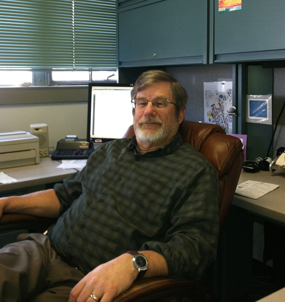

Congratulations, Al
===================

On May 15, 2013, Al Byam retired as Director of UMass Transportation
Services after having worked for the University for 35 years.

MIS decided to record a send-off video with a typically geeky touch.
This web-app wishes him well.

Usage
=====
* Load the page in as many browser pages as you want
* Enter the number of screens you'll be using (3 worked well for this
  message)
* On each window, enter the screen index starting with "0"
* Lastly, enter a time that you would like the message to start playing
  (24-hour time, of course)
* Click go

Having your computer clocks as sychronized as possible is a good idea.
